# 🏨 The Wild Oasis

> A modern hotel management dashboard built with React and Supabase

[](https://react.dev/)
[](https://vitejs.dev/)
[](https://styled-components.com/)
[](https://tanstack.com/query)

---

## 📋 Table of Contents

- [Overview](#-overview)
- [How to test](#-how-to-test)
- [Features](#-features)
- [Tech Stack](#-tech-stack)
- [Architecture](#-architecture)
- [Project Structure](#-project-structure)
- [Getting Started](#-getting-started)
- [Application Flow](#-application-flow)
- [Pages & Routes](#-pages--routes)
- [Key Components](#-key-components)
- [State Management](#-state-management)
- [Database Schema](#-database-schema)
- [Authentication Flow](#-authentication-flow)
- [Performance Optimizations](#-performance-optimizations)
- [Author](#-author)

---

## 🎯 Overview

**The Wild Oasis** is a comprehensive hotel management application designed for hotel employees to manage cabins, bookings, and guests. The application provides a complete dashboard with data visualization, real-time updates, and robust authentication.

### 🎨 Key Highlights

- 📊 **Interactive Dashboard** - Real-time statistics and charts
- 🏠 **Cabin Management** - Full CRUD operations for hotel cabins
- 📅 **Booking System** - Complete booking lifecycle management
- 👥 **User Management** - Secure authentication and user profiles
- 🌓 **Dark Mode** - Built-in theme switching
- 📱 **Responsive Design** - Works seamlessly across devices

---

## How to test
- In email enter (eslam.O.elkhabery@gmail.com)
- In password enter (101020013689741568)

---

## ✨ Features

### 🏠 Cabin Management
- ✅ View all cabins with details (name, capacity, price, discount)
- ✅ Add new cabins with image upload
- ✅ Edit existing cabin information
- ✅ Duplicate cabins for quick setup
- ✅ Delete cabins with confirmation
- ✅ Filter cabins (All, With Discount, No Discount)
- ✅ Sort cabins by name, price, or capacity

### 📅 Booking Operations
- ✅ View all bookings with status indicators
- ✅ Filter bookings by status (All, Checked In, Checked Out, Unconfirmed)
- ✅ Sort bookings by date or amount
- ✅ Check-in guests with optional breakfast
- ✅ Check-out guests
- ✅ View detailed booking information
- ✅ Delete bookings
- ✅ Today's activity overview

### 📊 Dashboard Analytics
- ✅ Total bookings count
- ✅ Sales statistics
- ✅ Check-in metrics
- ✅ Occupancy rate calculation
- ✅ Sales chart (last 7/30/90 days)
- ✅ Duration chart (stay length distribution)
- ✅ Recent bookings overview

### 👤 User Features
- ✅ Secure authentication with Supabase
- ✅ User registration (admin only)
- ✅ Profile management
- ✅ Avatar upload
- ✅ Password update
- ✅ Account settings

### ⚙️ Settings
- ✅ Minimum/Maximum booking length
- ✅ Maximum guests per booking
- ✅ Breakfast price configuration

### 🎨 UI/UX Features
- ✅ Dark mode / Light mode toggle
- ✅ Responsive design
- ✅ Loading states and spinners
- ✅ Error boundaries
- ✅ Toast notifications
- ✅ Modal dialogs
- ✅ Context menus
- ✅ Pagination for large datasets

---

## 🛠 Tech Stack

### Core Technologies

| Technology | Version | Purpose |
|------------|---------|---------|
| **React** | 19.2.0 | UI Framework |
| **Vite** | 7.2.4 | Build Tool & Dev Server |
| **React Router DOM** | 7.9.6 | Client-side Routing |
| **Supabase** | 2.86.0 | Backend & Database |

### State Management & Data Fetching

| Library | Version | Purpose |
|---------|---------|---------|
| **React Query** | 5.90.12 | Server State Management |
| **React Hook Form** | 7.68.0 | Form State Management |
| **Context API** | - | Global State (Theme) |

### Styling & UI

| Library | Version | Purpose |
|---------|---------|---------|
| **Styled Components** | 6.1.19 | CSS-in-JS Styling |
| **React Icons** | 5.5.0 | Icon Library |
| **Recharts** | 3.7.0 | Data Visualization |

### Utilities

| Library | Version | Purpose |
|---------|---------|---------|
| **date-fns** | 4.1.0 | Date Manipulation |
| **React Hot Toast** | 2.6.0 | Toast Notifications |
| **React Error Boundary** | 6.1.0 | Error Handling |
| **Zod** | 4.1.13 | Schema Validation |

---

## 🏗 Architecture

### Application Architecture

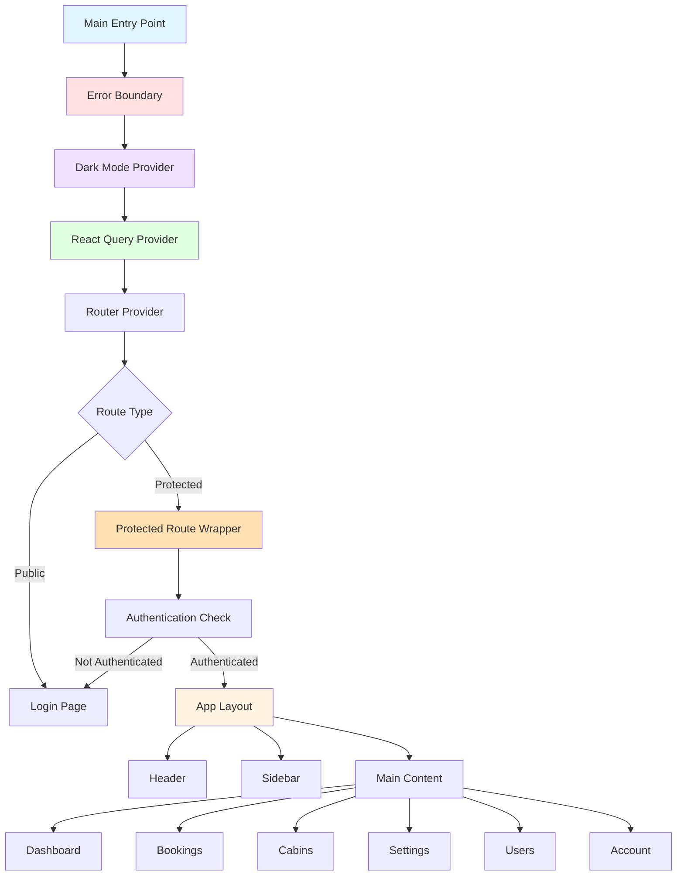

### Component Hierarchy

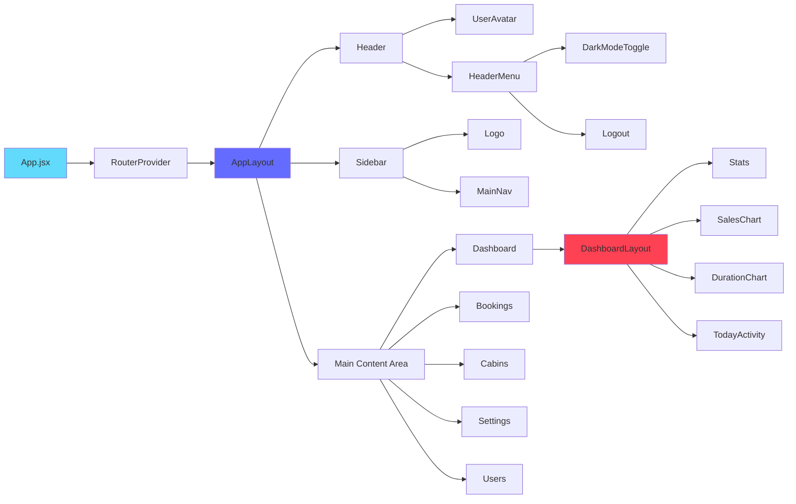

---

## 📁 Project Structure

```
the-wild-oasis/
├── 📂 public/
│   ├── logo-light.png
│   └── logo-dark.png
├── 📂 src/
│   ├── 📂 assets/
│   │   └── imgs/
│   ├── 📂 context/
│   │   └── ThemeContext.jsx          # Dark mode context
│   ├── 📂 features/
│   │   ├── 📂 authentication/
│   │   │   ├── LoginForm.jsx
│   │   │   ├── SignupForm.jsx
│   │   │   ├── UpdateUserDataForm.jsx
│   │   │   ├── UpdatePasswordForm.jsx
│   │   │   ├── UserAvatar.jsx
│   │   │   └── Logout.jsx
│   │   ├── 📂 bookings/
│   │   │   ├── BookingTable.jsx
│   │   │   ├── BookingRow.jsx
│   │   │   ├── BookingDetail.jsx
│   │   │   ├── BookingDataBox.jsx
│   │   │   └── BookingTableOperations.jsx
│   │   ├── 📂 cabins/
│   │   │   ├── CabinTable.jsx
│   │   │   ├── CabinRow.jsx
│   │   │   ├── CreateCabinForm.jsx
│   │   │   ├── AddCabin.jsx
│   │   │   └── CabinTableOperations.jsx
│   │   ├── 📂 check-in-out/
│   │   │   ├── CheckinBooking.jsx
│   │   │   ├── CheckoutButton.jsx
│   │   │   ├── TodayActivity.jsx
│   │   │   └── TodayItem.jsx
│   │   ├── 📂 dashboard/
│   │   │   ├── DashboardLayout.jsx
│   │   │   ├── DashboardFilter.jsx
│   │   │   ├── Stats.jsx
│   │   │   ├── Stat.jsx
│   │   │   ├── SalesChart.jsx
│   │   │   └── DurationChart.jsx
│   │   └── 📂 settings/
│   │       └── UpdateSettingsForm.jsx
│   ├── 📂 hooks/
│   │   ├── useBooking.js
│   │   ├── useBookings.js
│   │   ├── useCabins.js
│   │   ├── useCheckIn.js
│   │   ├── useCheckOut.js
│   │   ├── useLogin.js
│   │   ├── useLogout.js
│   │   ├── useSignup.js
│   │   ├── useUser.js
│   │   ├── useSettings.js
│   │   ├── useDarkMode.js
│   │   ├── useClicks.js
│   │   ├── useLocalStorageState.js
│   │   └── useMoveBack.js
│   ├── 📂 pages/
│   │   ├── Dashboard.jsx
│   │   ├── Bookings.jsx
│   │   ├── Booking.jsx
│   │   ├── CheckIn.jsx
│   │   ├── Cabins.jsx
│   │   ├── Users.jsx
│   │   ├── Settings.jsx
│   │   ├── Account.jsx
│   │   ├── Login.jsx
│   │   └── PageNotFound.jsx
│   ├── 📂 services/
│   │   ├── apiAuth.js                # Authentication API
│   │   ├── apiBookings.js            # Bookings API
│   │   ├── apiCabins.js              # Cabins API
│   │   ├── apiSettings.js            # Settings API
│   │   └── supabase.js               # Supabase client
│   ├── 📂 styles/
│   │   └── GlobalStyle.jsx           # Global styles
│   ├── 📂 ui/
│   │   ├── AppLayout.jsx
│   │   ├── Button.jsx
│   │   ├── Modal.jsx
│   │   ├── Table.jsx
│   │   ├── Form.jsx
│   │   ├── Spinner.jsx
│   │   ├── Filter.jsx
│   │   ├── SortBy.jsx
│   │   ├── Menus.jsx
│   │   ├── Pagination.jsx
│   │   └── ... (20+ UI components)
│   ├── 📂 utils/
│   │   ├── constants.js
│   │   └── helpers.js
│   ├── App.jsx
│   └── main.jsx
├── .gitignore
├── eslint.config.js
├── index.html
├── package.json
└── vite.config.js
```

---

## 🚀 Getting Started

### Prerequisites

- Node.js (v20.19.0 or higher)
- npm (v11.9.0 or higher)

### Installation

1. **Clone the repository**
   ```bash
   git clone <repository-url>
   cd the-wild-oasis
   ```

2. **Install dependencies**
   ```bash
   npm install
   ```

3. **Set up Supabase**
   - Create a Supabase project at [supabase.com](https://supabase.com)
   - Update `src/services/supabase.js` with your credentials:
     ```javascript
     export const supabaseUrl = "YOUR_SUPABASE_URL";
     const supabaseKey = "YOUR_SUPABASE_KEY";
     ```

4. **Run the development server**
   ```bash
   npm run dev
   ```

5. **Build for production**
   ```bash
   npm run build
   ```

6. **Preview production build**
   ```bash
   npm run preview
   ```

---

## 🔄 Application Flow

### User Journey Map

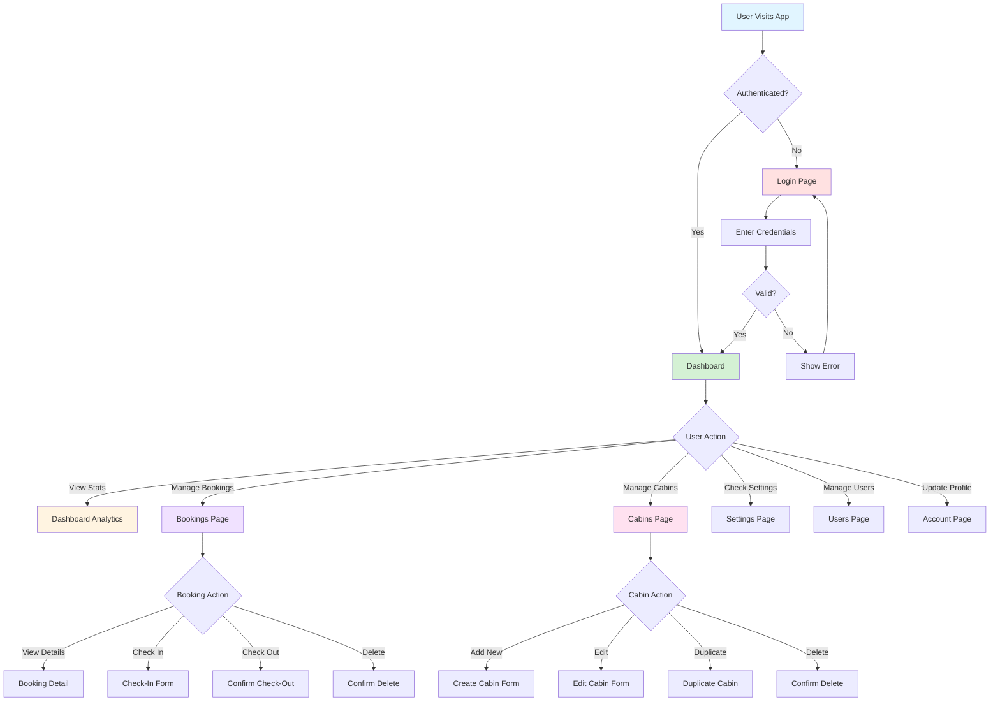

### Data Flow

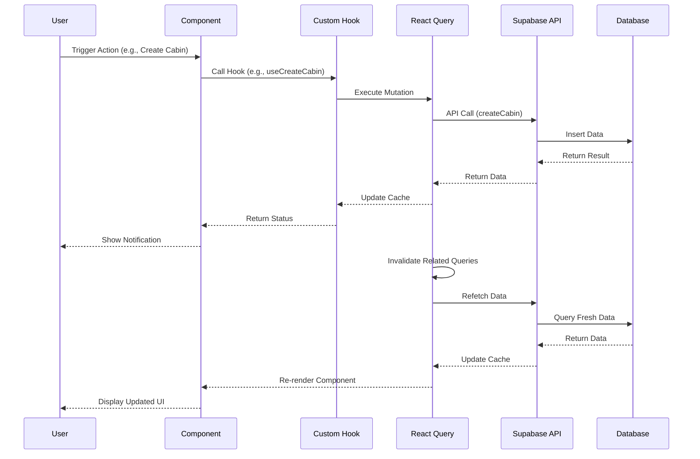

---

## 🗺 Pages & Routes

### Route Configuration

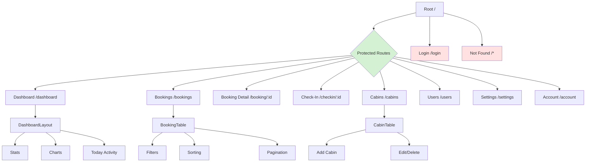

### Route Table

| Route | Component | Protection | Description |
|-------|-----------|------------|-------------|
| `/` | Dashboard (redirect) | ✅ Protected | Redirects to dashboard |
| `/dashboard` | Dashboard | ✅ Protected | Main dashboard with statistics |
| `/bookings` | Bookings | ✅ Protected | List of all bookings |
| `/booking/:id` | Booking | ✅ Protected | Single booking details |
| `/checkin/:id` | CheckIn | ✅ Protected | Check-in process |
| `/cabins` | Cabins | ✅ Protected | Cabin management |
| `/users` | Users | ✅ Protected | User creation (admin only) |
| `/settings` | Settings | ✅ Protected | Application settings |
| `/account` | Account | ✅ Protected | User profile |
| `/login` | Login | ❌ Public | Login page |
| `*` | PageNotFound | ❌ Public | 404 page |

---

## 🧩 Key Components

### Component Categories

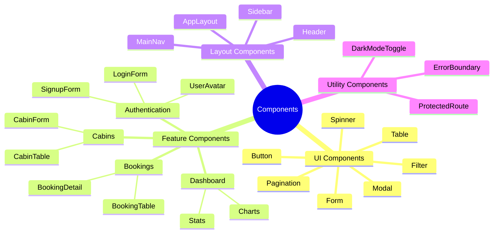

### Reusable UI Components

#### 🔘 Button Component

**Props:**
- `$size`: `small` | `medium` | `large`
- `$variation`: `primary` | `secondary` | `danger`

**Usage:**
```jsx
<Button $size="large" $variation="primary">
  Click Me
</Button>
```

#### 🪟 Modal Component (Compound Component Pattern)

**Usage:**
```jsx
<Modal>
  <Modal.Open opens="cabin-form">
    <Button>Add Cabin</Button>
  </Modal.Open>
  <Modal.Window name="cabin-form">
    <CreateCabinForm />
  </Modal.Window>
</Modal>
```

#### 📋 Table Component (Compound Component Pattern)

**Usage:**
```jsx
<Table columns="0.6fr 1.8fr 2.2fr 1fr 1fr 1fr">
  <Table.Header>
    <div>Cabin</div>
    <div>Capacity</div>
    <div>Price</div>
  </Table.Header>
  <Table.Body 
    data={cabins} 
    render={(cabin) => <CabinRow cabin={cabin} />} 
  />
  <Table.Footer>
    <Pagination count={totalCount} />
  </Table.Footer>
</Table>
```

#### 🔍 Filter Component

**Usage:**
```jsx
<Filter
  filterField="status"
  options={[
    { value: "all", label: "All" },
    { value: "checked-in", label: "Checked In" },
    { value: "checked-out", label: "Checked Out" },
  ]}
/>
```

---

## 🔐 State Management

### State Management Strategy

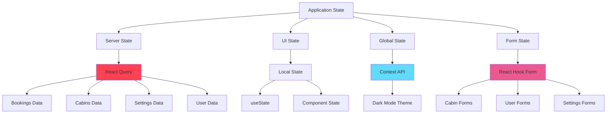

### React Query Configuration

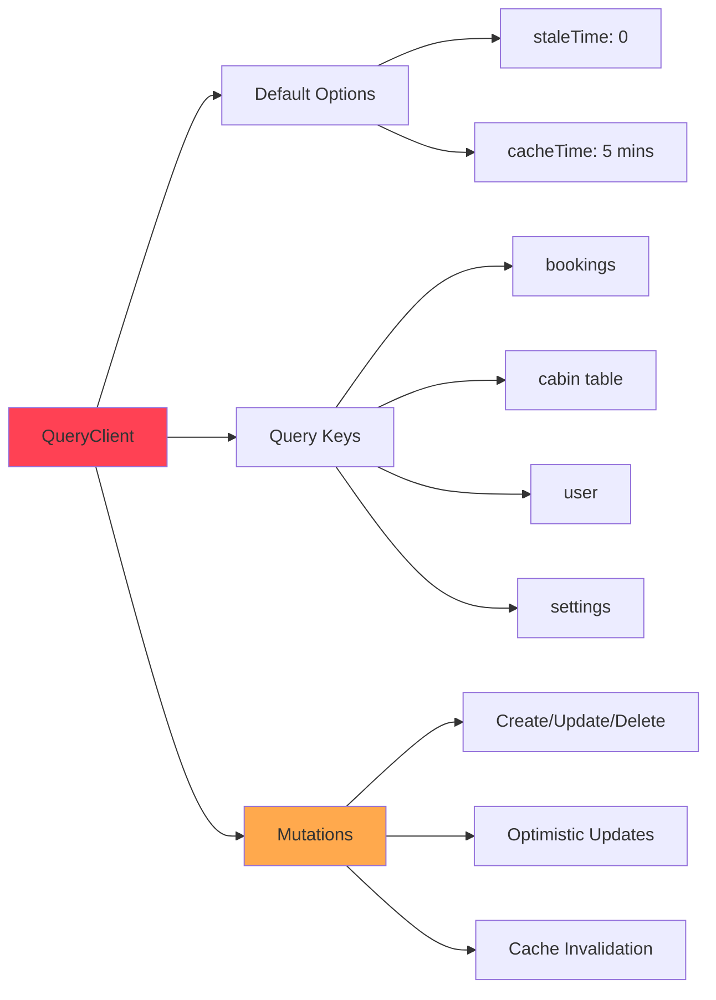

### Custom Hooks Architecture

| Hook | Purpose | Returns |
|------|---------|---------|
| `useBookings()` | Fetch bookings with filters/sorting | `[isLoading, bookings, error]` |
| `useBooking()` | Fetch single booking | `[isLoading, booking, error]` |
| `useCabins()` | Fetch cabins with pagination | `[isPending, cabins, isError, error]` |
| `useCreateCabin()` | Create new cabin | `[isCreating, createCabin]` |
| `useDeleteCabin()` | Delete cabin | `[isDeleting, deleteCabin]` |
| `useCheckIn()` | Check-in booking | `[isLoading, checkIn]` |
| `useCheckOut()` | Check-out booking | `[isLoading, checkOut]` |
| `useLogin()` | User login | `[isLoading, login]` |
| `useUser()` | Get current user | `{isLoading, user, isAuthenticated}` |
| `useSettings()` | Fetch settings | `[isLoading, settingsData, error]` |
| `useDarkMode()` | Dark mode toggle | `{isDarkMode, toggleDarkMode}` |

---

## 🗄 Database Schema

### Entity Relationship Diagram

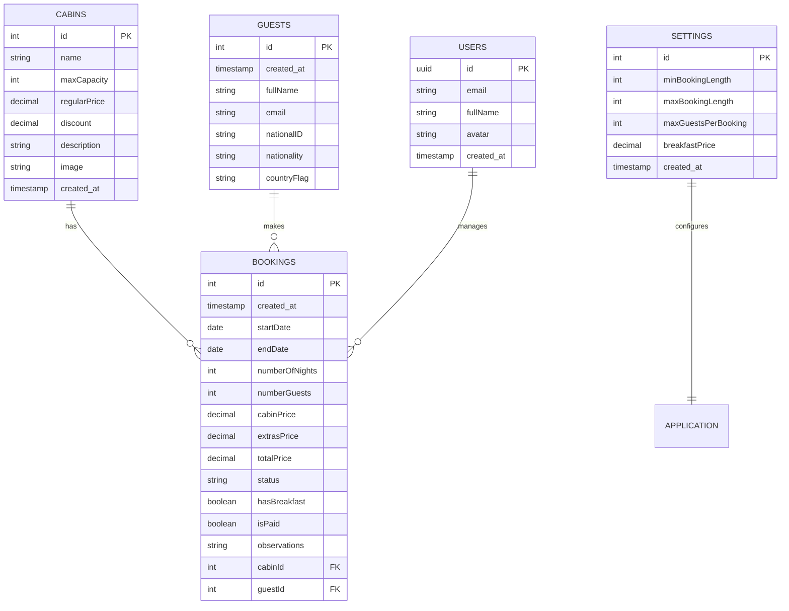

### Database Tables

#### 📋 Cabins Table
| Field | Type | Constraints | Description |
|-------|------|-------------|-------------|
| `id` | INTEGER | PRIMARY KEY | Unique identifier |
| `name` | VARCHAR | NOT NULL | Cabin name |
| `maxCapacity` | INTEGER | NOT NULL | Maximum guests |
| `regularPrice` | DECIMAL | NOT NULL | Base price |
| `discount` | DECIMAL | DEFAULT 0 | Discount amount |
| `description` | TEXT | - | Cabin description |
| `image` | VARCHAR | - | Image URL |
| `created_at` | TIMESTAMP | DEFAULT NOW() | Creation timestamp |

#### 📅 Bookings Table
| Field | Type | Constraints | Description |
|-------|------|-------------|-------------|
| `id` | INTEGER | PRIMARY KEY | Unique identifier |
| `created_at` | TIMESTAMP | DEFAULT NOW() | Creation timestamp |
| `startDate` | DATE | NOT NULL | Check-in date |
| `endDate` | DATE | NOT NULL | Check-out date |
| `numberOfNights` | INTEGER | NOT NULL | Stay duration |
| `numberGuests` | INTEGER | NOT NULL | Number of guests |
| `cabinPrice` | DECIMAL | NOT NULL | Cabin cost |
| `extrasPrice` | DECIMAL | DEFAULT 0 | Additional charges |
| `totalPrice` | DECIMAL | NOT NULL | Total amount |
| `status` | VARCHAR | NOT NULL | Booking status |
| `hasBreakfast` | BOOLEAN | DEFAULT FALSE | Breakfast included |
| `isPaid` | BOOLEAN | DEFAULT FALSE | Payment status |
| `observations` | TEXT | - | Special requests |
| `cabinId` | INTEGER | FOREIGN KEY | References cabins |
| `guestId` | INTEGER | FOREIGN KEY | References guests |

#### 👥 Guests Table
| Field | Type | Constraints | Description |
|-------|------|-------------|-------------|
| `id` | INTEGER | PRIMARY KEY | Unique identifier |
| `created_at` | TIMESTAMP | DEFAULT NOW() | Creation timestamp |
| `fullName` | VARCHAR | NOT NULL | Guest name |
| `email` | VARCHAR | NOT NULL | Email address |
| `nationalID` | VARCHAR | - | ID number |
| `nationality` | VARCHAR | - | Country |
| `countryFlag` | VARCHAR | - | Flag URL |

#### ⚙️ Settings Table
| Field | Type | Constraints | Description |
|-------|------|-------------|-------------|
| `id` | INTEGER | PRIMARY KEY | Always 1 (singleton) |
| `minBookingLength` | INTEGER | NOT NULL | Minimum nights |
| `maxBookingLength` | INTEGER | NOT NULL | Maximum nights |
| `maxGuestsPerBooking` | INTEGER | NOT NULL | Max guests |
| `breakfastPrice` | DECIMAL | NOT NULL | Breakfast cost |
| `created_at` | TIMESTAMP | DEFAULT NOW() | Creation timestamp |

---

## 🔐 Authentication Flow

### Authentication Process

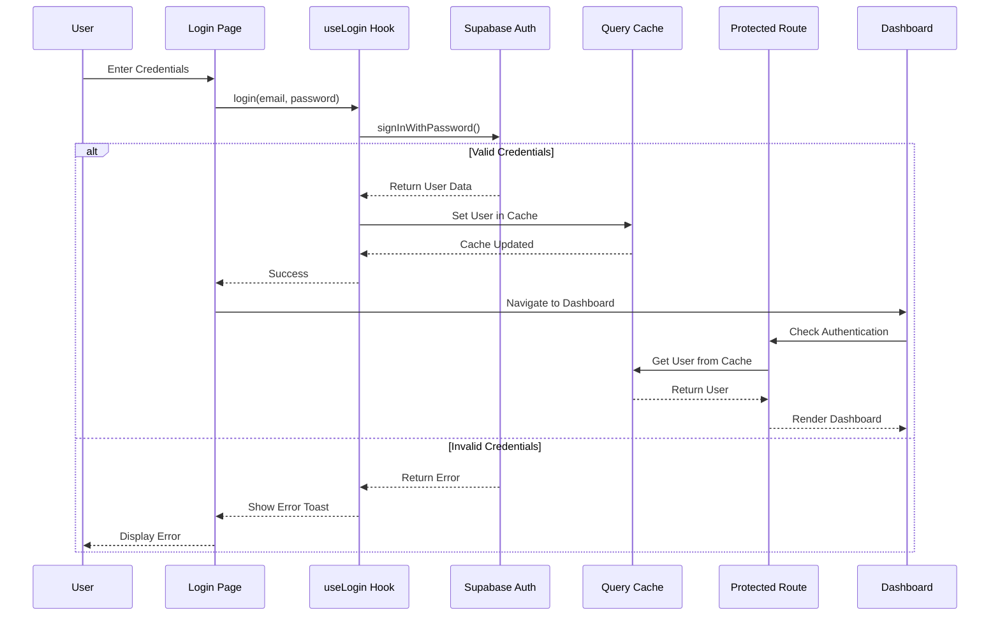

### User Session Management

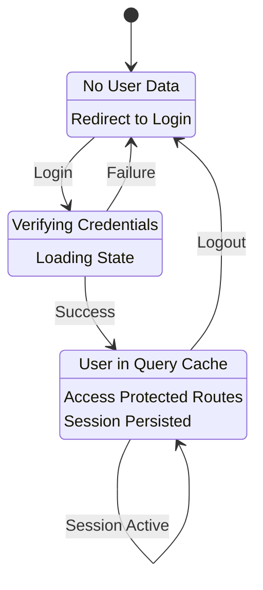

### Protected Route Logic

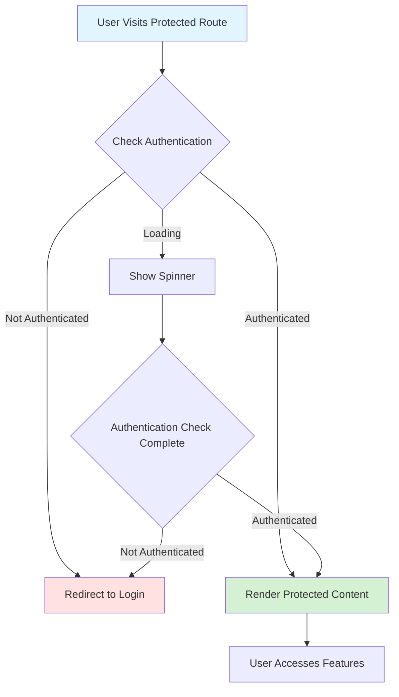

---

## ⚡ Performance Optimizations

### Optimization Strategies

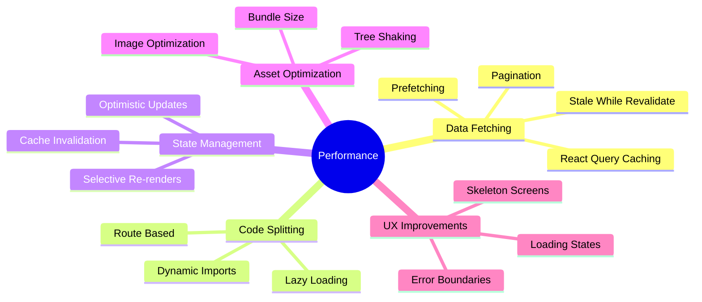

### React Query Optimizations

| Feature | Implementation | Benefit |
|---------|---------------|---------|
| **Caching** | Default 5-minute cache | Reduces API calls |
| **Prefetching** | Next/Previous page prefetch | Instant page transitions |
| **Stale Time** | 0 seconds (always fresh) | Real-time data updates |
| **Retry** | 3 retries with exponential backoff | Handles network failures |
| **Deduplication** | Automatic request deduplication | Prevents duplicate calls |
| **Background Updates** | Refetch on window focus | Keeps data synchronized |

### Pagination Strategy

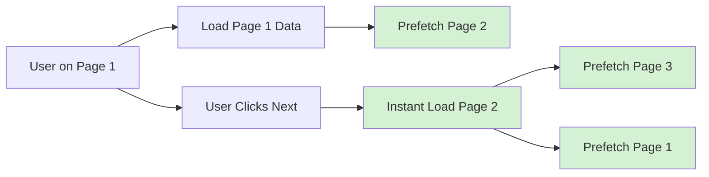

---

## 📊 Data Visualization

### Dashboard Charts

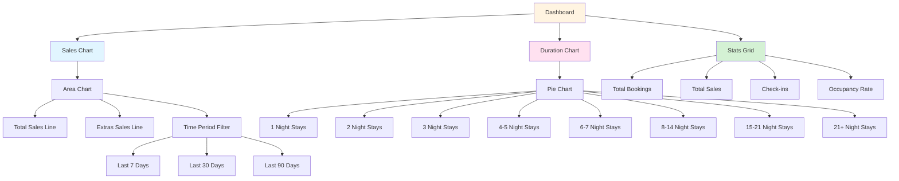

---

## 🎨 Theming System

### Dark Mode Implementation

```mermaid
graph TB
    A[User Toggles Theme] --> B[DarkModeContext]
    B --> C{Current Theme}
    C -->|Light| D[Switch to Dark]
    C -->|Dark| E[Switch to Light]
    
    D --> F[Update Context State]
    E --> F
    
    F --> G[Save to LocalStorage]
    F --> H[Update CSS Variables]
    
    H --> I[Document Root Class]
    I --> J[.dark-mode]
    I --> K[.light-mode]
    
    J --> L[Dark CSS Variables]
    K --> M[Light CSS Variables]
    
    L --> N[Re-render Components]
    M --> N
    
    style B fill:#f0e1ff
    style J fill:#1f2937
    style K fill:#f9fafb
```

### CSS Variable System

| Variable | Light Mode | Dark Mode | Usage |
|----------|------------|-----------|-------|
| `--color-grey-0` | `#fff` | `#18212f` | Backgrounds |
| `--color-grey-50` | `#f9fafb` | `#111827` | Subtle backgrounds |
| `--color-grey-700` | `#374151` | `#e5e7eb` | Text color |
| `--color-brand-600` | `#4f46e5` | `#4f46e5` | Primary actions |
| `--shadow-md` | `rgba(0,0,0,0.06)` | `rgba(0,0,0,0.3)` | Shadows |

---

## 🔄 Booking Lifecycle

### Booking State Machine

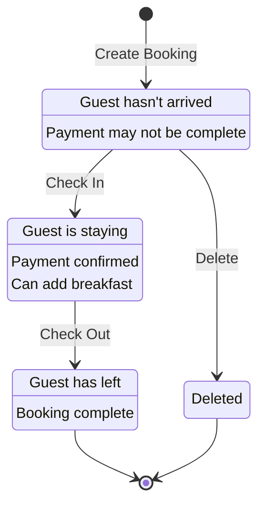

### Check-In Process

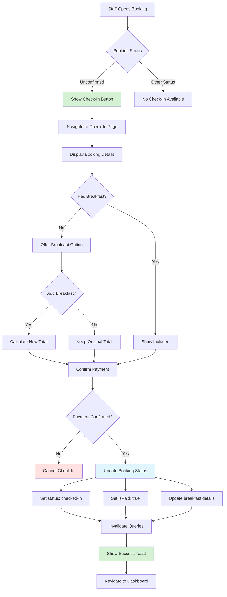

---

## 📱 Responsive Design

### Breakpoint Strategy

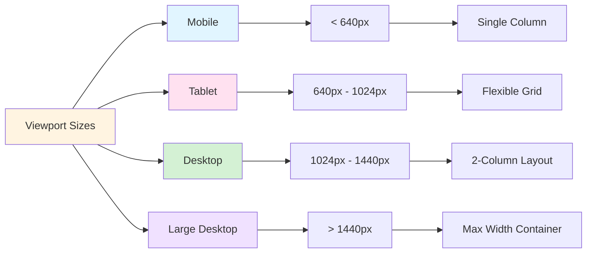

---

## 🛡 Error Handling

### Error Boundary Strategy

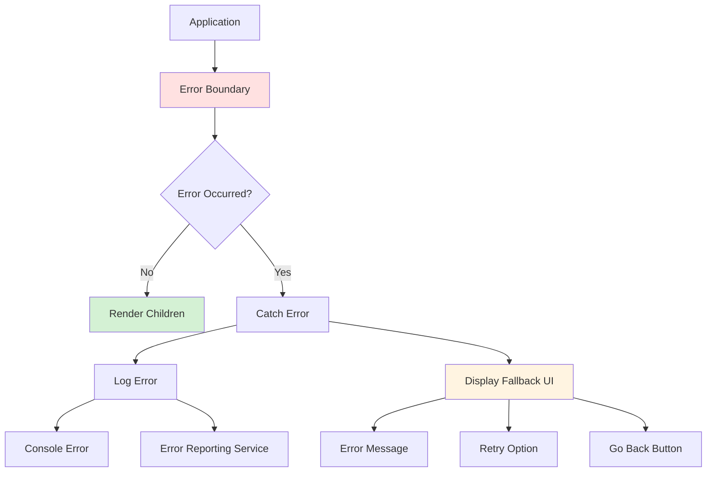

### Error Types

| Error Type | Handling Strategy | User Experience |
|------------|------------------|-----------------|
| **Network Error** | Retry with exponential backoff | Toast notification + retry button |
| **Authentication Error** | Redirect to login | Clear message + login redirect |
| **Validation Error** | Show inline errors | Form field highlights |
| **Not Found Error** | 404 page | Friendly message + navigation |
| **Permission Error** | Show message | Explain required permissions |
| **Application Error** | Error boundary | Fallback UI + reload option |

---

## 🚀 Deployment

### Build Process

```mermaid
graph LR
    A[Source Code] --> B[Vite Build]
    B --> C[Tree Shaking]
    C --> D[Code Splitting]
    D --> E[Minification]
    E --> F[Asset Optimization]
    F --> G[dist/ Folder]
    
    G --> H[Static Files]
    H --> I[HTML]
    H --> J[JavaScript Bundles]
    H --> K[CSS]
    H --> L[Images]
    
    style B fill:#646cff
    style G fill:#d4f1d4
```

---

## 📚 Learning Resources

This project was inspired by **Jonas Schmedtmann's React course**, which covers:

- ⚛️ React fundamentals and advanced patterns
- 🎣 Custom hooks and composition
- 🔄 React Query for server state
- 🎨 Styled Components
- 🏗 Component architecture
- 📊 Data visualization with Recharts
- 🔐 Authentication flows
- 🗄 Supabase integration

---

## 👨‍💻 Author

**Created by: Eslam Omar**

Inspired by Jonas Schmedtmann's React course

---

## 📄 License

This project is for educational purposes.

---

## 🙏 Acknowledgments

- Special thanks to **Jonas Schmedtmann** for the excellent React course
- The React and Supabase communities for amazing tools and documentation
- All open-source contributors whose libraries made this project possible

---

<div align="center">

### ⭐ Star this repository if you found it helpful!

**Built with ❤️ using React and Supabase**

</div>
